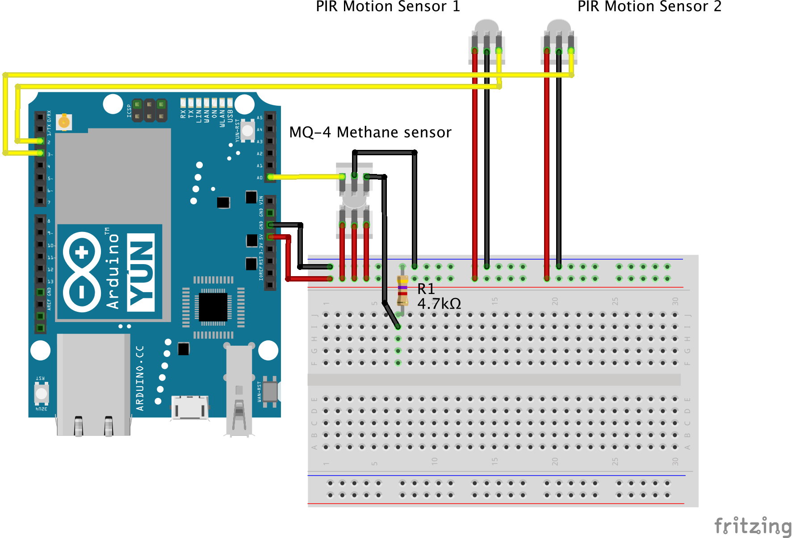

# Bathroom sensor

The bathroom sensor consists of two [PIR motion sensors](https://www.sparkfun.com/products/13285) for determining whether the bathroom is reserved or not and one [MQ-4 methane sensor](https://www.sparkfun.com/products/9404) for measuring air quality.

The bathroom is reserved when either of the two motion sensors detect movement and unreserved when both motion sensors report no movement. Methane level is measured in ppm.

The motion sensors have 30 seconds cooldown time that is they report no movement after 30 seconds period of no movement.

The methane sensor has to heat up for a few minutes after powering up for the measurements to be reliable.

## Wiring example



## Code example

The example sketch works on Arduino Yun and Yun Mini boards. The sketch sends a JSON string message to the server via HTTP POST every 30 seconds. The message contains the current reserved state of the bathroom and the methane level. The message is also sent immediately when either of the motion sensors report movement after both reporting no movement previously (the bathroom became occupied) and when both of the motion sensors report no movement after either of them reporting movement previously (the bathroom became unoccupied).

```
#include <Bridge.h>
#include <YunClient.h>

#include "vor_utils.h"

#include "vor_led.h"
#include "vor_motion.h"
#include "vor_methane.h"

#define INTERVAL 30000

#define PAYLOAD_FORMAT "{\"id\":\"toilet8am\",\"type\":\"toilet\",\"reserved\":%s,\"methane\":%s}"

#define MOTION1_PIN 2
#define MOTION2_PIN 3
#define METHANE_PIN A0

YunClient client;

VorLed led;
VorMotion motion1(MOTION1_PIN);
VorMotion motion2(MOTION2_PIN);
VorMethane methane(METHANE_PIN);

int prevMotion1Value = HIGH;
int prevMotion2Value = HIGH;

uint64_t intervalTime = 0;

void setup() {
    Serial.begin(9600);

    led.turnOn();
    Bridge.begin();
    led.turnOff();
}

void loop() {
    uint64_t now = millis();

    int motion1Value = motion1.read();
    int motion2Value = motion2.read();
    float methaneValue = methane.readProcessed();

    bool change = (prevMotion1Value != motion1Value || prevMotion2Value != motion2Value) && // some change
        ( (prevMotion1Value == HIGH && prevMotion2Value == HIGH) || // previously no motion
          (motion1Value == HIGH && motion2Value == HIGH) ); // at the moment no motion

    prevMotion1Value = motion1Value;
    prevMotion2Value = motion2Value;
    bool reservedValue = motion1Value == LOW || motion2Value == LOW;

    if (change || now - intervalTime > INTERVAL) {
        intervalTime = now;

        const char* reserved = reservedValue ? "true" : "false";
        char methane[16];
        dtostrf(methaneValue, 16, 2, methane);
        char message[128];
        sprintf(message, PAYLOAD_FORMAT, reserved, methane);

        post(client, message);
        Serial.println(message);
    }
}
```
