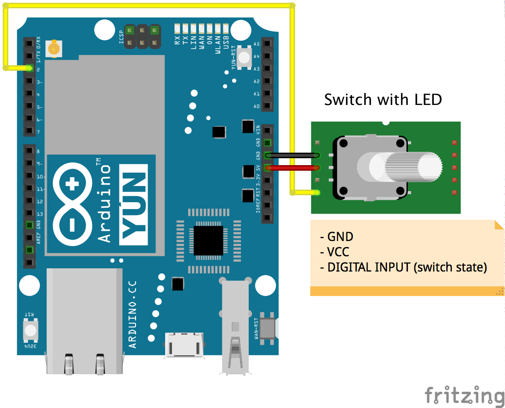

# Food switch

[A toggle switch](https://www.sparkfun.com/products/11310) which sends a JSON string message to the server via HTTP POST when it is turned on and every 30 seconds while it is on.

The purpose of the switch is to inform when there is some food to be grabbed on the kitchen table. A Raspberry Pi client that is connected to a webcam then reacts to the message sent by the switch and takes a picture of the food on the table.

The switch has a signal output which is set to HIGH when the switch is on and LOW when the switch is off. The LED on the tip of the switch lights up when the when the switch is on.

## Wiring example



## Code example

```
#include <Bridge.h>
#include <YunClient.h>

#include "vor_utils.h"

#include "vor_led.h"
#include "vor_switch.h"

#define INTERVAL 30000

#define PAYLOAD "{\"id\":\"button-food\",\"type\":\"button\"}"

#define SWITCH_PIN 2

YunClient client;

VorLed led;
VorSwitch vorSwitch(SWITCH_PIN);
int switchValue = LOW;
uint64_t intervalTime = 0;

void setup() {
    Serial.begin(9600);

    led.turnOn();
    Bridge.begin();
    led.turnOff();
}

void loop() {
    int value = vorSwitch.read();

    uint64_t now = millis();
    if (switchValue != value || now - intervalTime > INTERVAL) {
        switchValue = value;
        intervalTime = now;
        if (HIGH == switchValue) {
            post(client, PAYLOAD);
        }
    }
}
```
