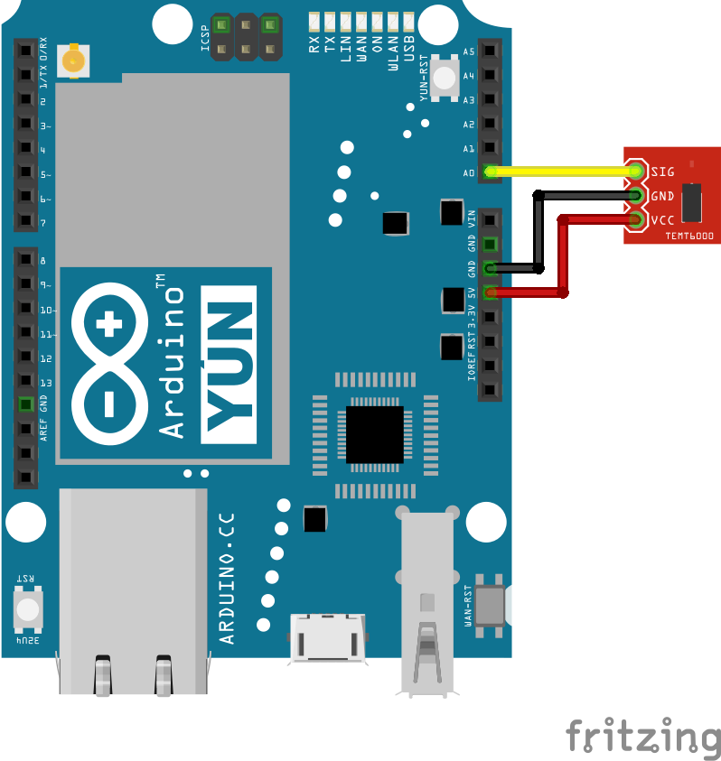

# Ambient light sensor

[Ambient light sensor](https://www.sparkfun.com/products/8688) that reports illuminance in lux.

## Wiring example



## Code example

```cpp
#include "vor_light.h"
#include "vor_led.h"

VorLight light(A0);
VorLed led;

void setup() {
    Serial.begin(9600);
    while (!Serial);
}

void loop() {
    float value = light.readProcessed();
    Serial.println(value);
    delay(1000);
}
```
