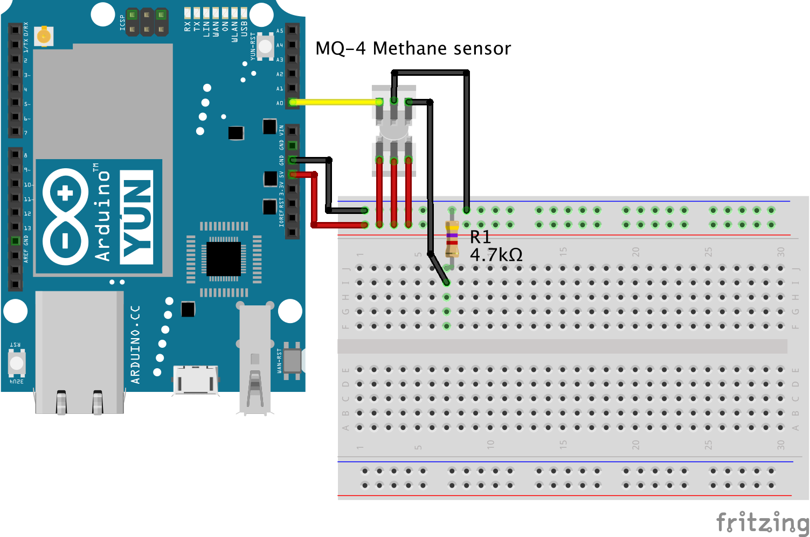

# Methane sensor

[A methane sensor](https://www.sparkfun.com/products/9404) that reports methane (reacts also to other gases such as alcohols and propane) concentration from 300 to 10000 ppm. The sensor has an internal heater which needs to be let to heat up for a few minutes. Because of the heater the sensor heats noticeably during use.

## Wiring example



## Code example

```cpp
#include "vor_methane.h"
#include "vor_led.h"

VorMethane methane(A0);
VorLed led;

void setup() {
    Serial.begin(9600);
}

void loop() {
    float value = methane.readProcessed();
    Serial.println(value);
    delay(1000);
}
```
