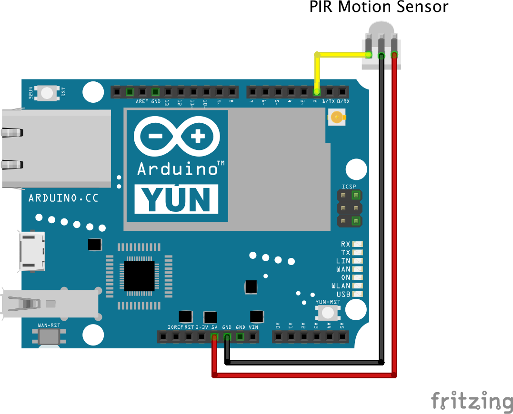

# PIR motion sensor

[A PIR motion sensor](https://www.sparkfun.com/products/13285) that has a signal output that is pulled LOW if the sensor detects movement and HIGH otherwise. The sensor uses the [internal pull-up resistor](https://www.arduino.cc/en/Tutorial/InputPullupSerial) of the Arduino digital pin. Multiple motion sensors can be connected to a common digital pin on Arduino to pull the pin LOW when any of the sensors detect movement.

## Wiring example



## Code example

```cpp
#include "vor_motion.h"
#include "vor_led.h"

#define MOTION_PIN 2

VorMotion motion(MOTION_PIN);
VorLed led;

int motionState = motion.peek();

void setup() {
    Serial.begin(9600);
}

void loop() {
    int state = motion.read();

    if (motionState != state) {
        motionState = state;
        Serial.println(motionState);

        if (LOW == motionState) {
            led.turnOn();
        } else {
            led.turnOff();
        }
    }
}
```
