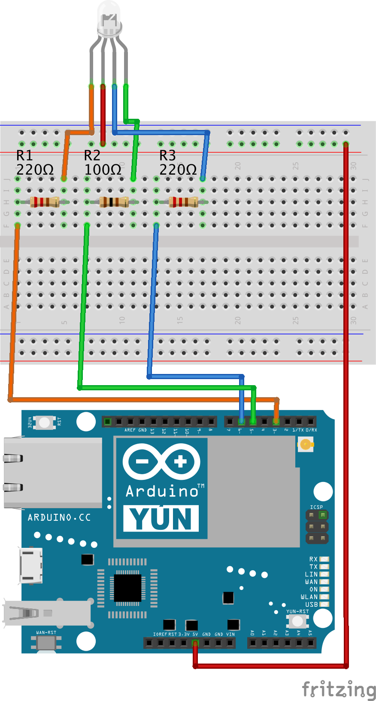

# RGB LED (common anode)

[A common anode RGB LED](https://www.sparkfun.com/products/10820) in which the common anode is connected to the 5V pin and other leads are connected to digital pins (PWM pins for analog output) on Arduino. The analog output values are inverted when calling the setter functions of the class (writeRed, writeGreen, writeBlue and write) that is with 0 as a parameter value the LED is off and with 255 the LED is shining bright. The class uses [gamma correction lookup table](https://learn.adafruit.com/led-tricks-gamma-correction/the-quick-fix) to adjust the output values. In the example a 220 ohm voltage drop resistor is used with the red and blue LEDs and a 100 ohm resistor with the green LED for achieving approximately equal brightness for the LEDs.

## Wiring example



## Code example

The example sketch is similar to the [fading example](https://www.arduino.cc/en/Tutorial/Fading) in the Arduino tutorials.

```cpp
#include "vor_rgbled.h"

#define RED_PIN 3
#define GREEN_PIN 5
#define BLUE_PIN 6

#define ALL 99

VorRgbLed led(RED_PIN, GREEN_PIN, BLUE_PIN);

int leds[] = { RED_PIN, GREEN_PIN, BLUE_PIN, ALL };
int index = -1;

void setup() {
    Serial.begin(9600);
    while (!Serial);
}

void loop() {
    int selectedLed = leds[++index % 4];

    for (int fadeValue = 0 ; fadeValue <= 255; fadeValue += 5) {
        writeLed(selectedLed, fadeValue);
        delay(30);
    }

    for (int fadeValue = 255 ; fadeValue >= 0; fadeValue -= 5) {
        writeLed(selectedLed, fadeValue);
        delay(30);
    }
}

void writeLed(int selectedLed, int value) {
    if (RED_PIN == selectedLed) {
        led.writeRed(value);
    } else if (GREEN_PIN == selectedLed) {
        led.writeGreen(value);
    } else if (BLUE_PIN == selectedLed) {
        led.writeBlue(value);
    } else {
        led.write(value, value, value);
    }
}

```
